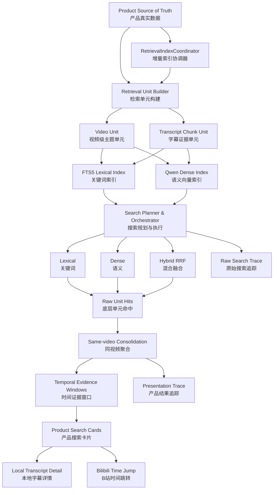
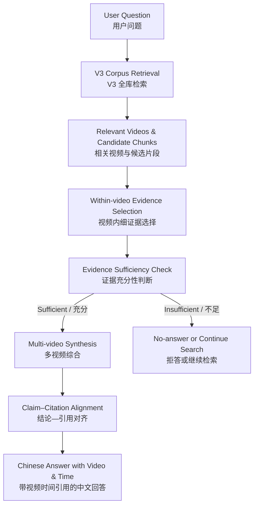

# 拾流 V3 Version Decision

> **文档类型**：Version Decision / 版本决策记录  
> **版本对象**：Shiliu V3 Retrieval  
> **决策状态**：`Ready for Main-session Review`  
> **当前结论**：V3 核心任务基本完成；允许收口，不继续在 Stage 6 内调优检索  
> **后续动作**：生成 V3 Closeout 与 Main Session Handoff，由主 Session 决定 V3.5 / V4 的正式边界与编号  
> **冻结评测语料**：144 Videos / 1,555 Retrieval Units / 1,412 Transcript Chunks  
> **正式评测集**：24 Queries / 452 Query–Video Judgments / 10 Human-approved Intervals  
> **评测报告**：`V3_STAGE6B_FORMAL_RETRIEVAL_EVAL_AND_EVIDENCE_REPORT.md`

---

## 0. Executive Decision / 执行结论

拾流 V3 的正式定位是：

> **一个面向个人 B 站视频收藏库的本地视频证据检索系统。它能够在标题、简介、AI 派生主题信息、用户笔记和原始字幕之间建立可增量维护的关键词、语义和混合检索索引，将重复字幕 Chunk 聚合为视频级结果，提供结构化过滤、原字幕来源和粗粒度时间导航，并通过冻结语料、人工 Gold、离线指标和失败案例完成可复现评测。**

V3 已经完成并验证：

1. 可重建、可增量维护的检索派生层；
2. FTS5 关键词检索；
3. Qwen Dense 语义检索；
4. RRF Hybrid 混合检索；
5. 确定性 Query Planning 与 Auto Routing；
6. 同视频聚合和证据窗口；
7. 原字幕时间来源与跳转；
8. 收藏夹、状态、Mark、UP 主和时间过滤；
9. Web 搜索页面；
10. Snapshot、Human Gold、Trace、测试和正式 Eval。

V3 没有完成，也不应被描述为已经完成：

1. 精确到具体证据句的时间定位；
2. 稳定的无答案拒绝；
3. 中文 Query 对英文字幕的已验证跨语言检索；
4. Claim–Evidence Alignment / 结论—证据对齐；
5. 多视频带引用综合回答；
6. Agentic Search；
7. 自动 ASR、翻译、重新索引、补答的闭环。

因此，V3 的最终结论不是“完整知识问答系统已经完成”，而是：

```text
V3 已经完成可靠的视频发现与字幕候选检索底座；
精细证据选择、证据充分性和带引用回答属于后续版本。
```

---

## 1. Decision Authority / 决策权限

本文件负责：

- 固定 V3 已交付能力；
- 固定 Stage 6 评测结论；
- 区分 `Accepted / Degraded / Deferred / Rejected`；
- 规定 V3 可以如何对外描述；
- 规定哪些问题不得继续混入 Stage 6；
- 向 Main Session 提交 V3.5 / V4 候选顺序；
- 形成 V3 Closeout 的上游决策依据。

本文件不负责：

- 直接批准 V3.5；
- 直接批准 V4；
- 修改长期项目总路线；
- 宣布整个拾流项目完成；
- 直接修改检索实现；
- 直接把 Auto 改成默认模式；
- 直接加入 Reranker、Query Rewrite 或 Agent；
- 替代 Main Session 的最终版本编号决策。

最终状态应为：

```text
Ready for Main-session Review
```

---

## 2. Original Mission / V3 原始任务

V3 开始前，拾流已经具备：

```text
收藏夹增量同步
→ 字幕获取 / ASR
→ 字幕整理
→ AI 总结
→ 本地 Artifact 落盘
→ Web 查看
→ 阅读 / 关注 / 忽略 / 归档状态
```

但这些能力仍然主要服务于“内容生产”和“逐条浏览”。当视频数量增加后，出现了新的核心问题：

> 用户知道自己曾经收藏或处理过某个主题，但无法快速找回相关视频、观点或字幕位置。

V3 的原始任务因此被定义为：

```text
现有视频、字幕、摘要和笔记
→ 建立可搜索证据库
→ 比较 Lexical / Dense / Hybrid
→ 支持结构化 Filter
→ 返回视频级结果与字幕时间
→ 通过离线 Eval 证明能力和边界
```

V3 明确不是：

- 完整 RAG Answer；
- Agent；
- Multi-Agent；
- GraphRAG；
- Memory OS；
- 通用知识库平台；
- 生产级搜索 SaaS；
- 以堆叠技术名词为目标的展示项目。

---

## 3. End-to-end Architecture / 最终架构



### 3.1 数据真相与派生索引

正式原则：

```text
Product Data / Artifacts
= Source of Truth

Retrieval Index
= Rebuildable Derived State
```

检索索引不是第二套业务数据真相。任何索引状态都应能从 Product 数据和 Artifact 重建。

### 3.2 两种检索单元

#### Video Unit

用于：

- 整体主题发现；
- 标题和简介检索；
- AI 总结与实体导航；
- 无字幕视频的最低限度发现；
- 视频级 Metadata Filter。

#### Transcript Chunk Unit

用于：

- 字幕正文检索；
- 局部证据定位；
- 时间窗口；
- 后续引用；
- Raw Segment Anchor。

### 3.3 原字幕边界

Transcript Chunk 必须由完整 Raw Subtitle Segment 组成。

正式 Chunk 策略：

```text
目标字符数：约 800
正常最大字符数：约 1,200
最大时长：约 120 秒
重叠：上一 Chunk 最后一个完整字幕 Segment
```

不为了更长上下文模型扩大证据 Chunk，也不为了满足字符限制伪造字幕时间边界。

---

## 4. Stage-by-stage Delivery Review / 分阶段交付回顾

## 4.1 Phase 0 — Local Facts and Architecture Baseline

完成：

- 核查 SQLite；
- 核查 Artifact；
- 核查字幕和 Summary 格式；
- 核查 Product Writer；
- 确定检索为派生层；
- 确定不复制业务真相；
- 确定不依赖旧 Event 表强行做事件队列。

决策：

```text
Accepted
```

---

## 4.2 Stage 1 — Lexical Retrieval Baseline

Codex 交付：

- `retrieval_units`
- `retrieval_unit_folders`
- `retrieval_index_meta`
- `retrieval_units_fts`
- build / rebuild / replace / delete
- FTS5 trigram
- BM25
- 短字符串 substring fallback
- 结构化过滤
- 稳定 Unit ID
- 可重复重建

初始正式结果：

```text
142 Video Units
1,405 Transcript Chunks
1,547 Total Units
1,547 FTS Rows
```

Stage 1 证明：

- 关键词检索可用；
- 中文和中英混合检索可用；
- 结构化过滤可用；
- 索引可重建；
- Chunk 保留时间边界；
- 没有字幕的视频仍可拥有 Video Unit。

Stage 1 已知边界：

- trigram 不适合一至两个字符；
- Lexical 不能承担自然语言语义问题；
- 尚未接入 Product Lifecycle。

决策：

```text
Accepted with Follow-up
```

---

## 4.3 Stage 2 — Dense and Hybrid Retrieval

初版 Dense：

```text
BAAI/bge-small-zh-v1.5
512 dimensions
SQLite float32 BLOB
NumPy exact normalized dot product
```

Codex 交付：

- EmbeddingProvider；
- Dense Index；
- Dense rebuild/reuse/replace/delete；
- Token-aware Video Projection；
- RRF Hybrid；
- Metadata Filter 复用；
- 确定性 Tie-break。

关键失败：

```text
MCP
LangGraph
RAG
FAISS
```

在 BGE 下出现 ASCII Query Vector Collapse。

该失败被视为真实模型适配问题，而不是通过 Query 前缀、特殊规则或 Rewrite 掩盖。

决策：

```text
Stage 2 Accepted with Follow-up
BGE Model Adoption Rejected
Model Selection Gate Required
```

---

## 4.4 Model Selection and Adoption

最终采用：

```text
Qwen/Qwen3-Embedding-0.6B
512 Matryoshka dimensions
last-token pooling
L2 normalization
```

固定 Query Instruction：

```text
Given a Chinese or English AI and software engineering knowledge retrieval query,
retrieve the most relevant evidence passages.
```

Qwen 的价值：

- 修复纯 ASCII 技术实体 Collapse；
- 保持中文语义检索；
- 改善中英混合 Query；
- 适合拾流实际技术内容。

代价：

- 模型体积显著增大；
- Cold Load 较慢；
- 全量构建较慢。

正式判断：

```text
Cold Load
= Operational Metric

不是：
Model Adoption Gate
```

安全采用流程：

```text
Shadow Candidate Build
→ Compatibility Validation
→ Corpus Fingerprint
→ Database Backup
→ Authorization
→ Atomic Cutover
→ Post-cutover Verification
→ Rollback Path
```

决策：

```text
Model Selection Gate:
Accepted with Follow-up

Model Adoption:
Accepted with Follow-up
```

---

## 4.5 Stage 3 — Incremental Index Lifecycle

Codex 交付：

- `RetrievalIndexCoordinator`
- `retrieval_sync_state`
- `safe_sync_video`
- `remove_video`
- `reconcile`
- `retry_failed`
- `sync_status`
- Product commit 后触发索引同步
- Lexical / Dense 状态分离
- Stable cache
- Dense reuse
- Reconcile 健康检查

正式失败语义：

| 情况 | Lexical | Dense |
|---|---|---|
| Lexical 异常 | error | stale |
| Dense 未就绪 | current | not_ready |
| Dense 版本不兼容 | current | rebuild_required |
| Dense 其他异常 | current | error |

Stage 3 将检索从离线 Demo 升级为可持续维护的产品子系统。

决策：

```text
Accepted with Follow-up
```

---

## 4.6 Stage 4A — Search Planning and Raw API

Codex 交付：

```text
SearchRequest
→ SearchPlanner
→ SearchPlan
→ SearchOrchestrator
→ Explicit Retriever
→ RawSearchHit
→ Persistent Trace
```

运行时 Query Type：

- `exact_entity`
- `mixed_entity`
- `semantic_question`
- `keyword_phrase`

Auto 大体策略：

```text
短 ASCII 技术实体
→ Lexical

中英混合 / 语义问题
→ Hybrid
```

正式原则：

- 显式模式永远覆盖 Auto；
- 显式模式不得 fallback；
- Auto 只在明确 Dense 可用性错误下 fallback；
- CLI 与 API 使用同一 Orchestrator；
- 不使用 LLM Planner；
- 不引入 Query Rewrite。

决策：

```text
Accepted with Follow-up
```

---

## 4.7 Stage 4B — Product Evidence Result

Codex 交付：

- `SearchResultConsolidator`
- `EvidenceEnricher`
- `ProductSearchService`
- 一条视频一张卡片
- Raw Unit 去重
- Same-video Grouping
- Temporal Evidence Window
- 最强窗口
- 其他窗口折叠
- Raw Segment Anchor
- Chunk start fallback
- AI Chapter 辅助说明
- Presentation Trace

窗口初始合并 Gap：

```text
<= 20 seconds
```

Anchor 原则：

```text
精确实体 / 关键词
→ 在最佳 Window 内扫描 Raw Segment
→ 使用真实 Segment Start

语义 Query
→ 使用最佳 Chunk Start
→ 明确为相关片段起点
```

AI Chapter 不得覆盖原字幕时间。

Anchor Boundary Closure 修复了：

```text
RAG
```

错误匹配到：

```text
storage
paragraph
drag
```

等普通英文字符串的问题。

决策：

```text
Accepted with Follow-up
```

---

## 4.8 Stage 5 — Web Search Surface

Codex 交付：

- `/search`
- Query / Mode / Scope / Filter
- URL State
- 视频卡片
- 主窗口和附加窗口
- 本地字幕详情
- Bilibili 跳转
- Loading / Empty / Error / Fallback
- AbortController
- 安全 DOM 渲染
- Accessibility
- Responsive
- 浏览器真实验证

正式措辞：

```text
精确 Anchor：
从 HH:MM 播放

语义 Fallback：
从相关片段 HH:MM 开始
```

该措辞与 Stage 6 暴露出的粗粒度时间定位基本一致，没有严重夸大。

决策：

```text
Accepted with Follow-up
```

---

## 5. Stage 6 Evaluation Decision / 正式评测结论

## 5.1 Frozen Corpus

```text
144 videos
143 indexed videos
1,555 retrieval units
143 video units
1,412 transcript chunks
1,555 FTS rows
1,555 Dense rows
```

评测使用不可变 Snapshot，不使用 Live Product 数据。

## 5.2 Human Gold

```text
24 Queries
452 Query–Video Judgments
20 Held-out Queries
2 Negative Controls
10 Approved Intervals
```

最终标签：

```text
R_evidence: 104
R_title:      6
N:          337
U_title:      5
OOS:          0
```

定义：

```text
Video Discovery Relevant
= R_evidence + R_title

Evidence Retrieval Relevant
= R_evidence only
```

## 5.3 Video Discovery Metrics

Primary Condensed Judged Metrics over 22 positive queries:

| Mode | Recall@5 | Recall@10 | MRR@10 | Hit@1 | Hit@5 | Hit@10 |
|---|---:|---:|---:|---:|---:|---:|
| Lexical | 0.3500 | 0.4033 | 0.5000 | 0.5000 | 0.5000 | 0.5000 |
| Dense | 0.7840 | 0.8801 | 1.0000 | 1.0000 | 1.0000 | 1.0000 |
| Hybrid | 0.7840 | 0.8820 | 1.0000 | 1.0000 | 1.0000 | 1.0000 |
| Auto | 0.7775 | 0.8816 | 1.0000 | 1.0000 | 1.0000 | 1.0000 |

Held-out Discovery Recall@10：

```text
Lexical: 0.3704
Dense:   0.8972
Hybrid:  0.8995
Auto:    0.8995
```

解释边界：

```text
这些是 pooled / judged metrics，
不是全库穷举 Recall。
```

允许描述为：

> 在 Lexical、Dense、Hybrid 联合构造并人工审阅的候选池中，Dense/Hybrid 的 Top 10 覆盖约 88%–90% 的已知相关视频。

不得描述为：

> 找到了整个收藏库中 90% 的所有相关视频。

## 5.4 Evidence Retrieval Metrics

| Mode | Evidence Recall@5 | Evidence Recall@10 | MRR@10 |
|---|---:|---:|---:|
| Lexical | 0.3654 | 0.4093 | 0.5000 |
| Dense | 0.7777 | 0.8751 | 1.0000 |
| Hybrid | 0.7868 | 0.8770 | 1.0000 |
| Auto | 0.7777 | 0.8763 | 1.0000 |

结论：

- Dense 的语义召回价值成立；
- Hybrid 有局部增益；
- Auto 基本保持最佳显式模式能力；
- Lexical 不能承担复杂语义 Query。

## 5.5 Raw Duplicate Occupancy

| Mode | @10 | @20 | @50 |
|---|---:|---:|---:|
| Lexical | 0.1153 | 0.1319 | 0.1474 |
| Dense | 0.4847 | 0.5556 | 0.6515 |
| Hybrid | 0.4681 | 0.5535 | 0.6465 |
| Auto | 0.3417 | 0.4083 | 0.4824 |

Grouping Gain@10：

```text
Lexical: +0.455
Dense:   +0.591
Hybrid:  +0.500
Auto:    +0.636
```

结论：

> Same-video Grouping 解决了 Dense/Hybrid Raw Chunk 重复占位问题，是必要产品机制，不是 UI 装饰。

## 5.6 Window Metrics

Across 10 approved Query–Video pairs:

| Mode | Window Found@1 | Window Found@2 |
|---|---:|---:|
| Lexical | 0.10 | 0.20 |
| Dense | 0.70 | 0.90 |
| Hybrid | 0.70 | 1.00 |
| Auto | 0.60 | 0.80 |

但窗口长度：

| Mode | P50 | P90 | Max | Mean Predicted / Gold |
|---|---:|---:|---:|---:|
| Lexical | 236.25s | 249.49s | 252.80s | 20.85× |
| Dense | 236.12s | 582.37s | 1367.80s | 68.81× |
| Hybrid | 235.94s | 580.26s | 1367.80s | 64.09× |
| Auto | 252.80s | 623.31s | 1367.80s | 66.98× |

正式结论：

```text
Window 能覆盖正确大致区域，
但明显过宽。
```

## 5.7 Anchor Metrics

Precise Anchor Median Error：

```text
Lexical: 163.78s
Dense:   286.84s
Hybrid:  207.48s
Auto:    225.31s
```

Semantic Chunk Start 到 Gold 的中位距离约：

```text
568–571s
```

正式结论：

```text
V3 时间能力
= 粗粒度导航

不是：
精确证据时间定位
```

## 5.8 Negative Controls

负例：

- 量子纠错表面码阈值；
- Kubernetes CrashLoopBackOff。

结果：

```text
Lexical:
0 results

Dense / Hybrid / Auto:
10 nearest-neighbor results
```

结论：

> Dense/Hybrid 总能返回最近向量，不具备可靠 No-answer Rejection。

当前只有两条负例，不足以据此直接调固定阈值。

## 5.9 Filter

所有结构化 Filter Violation：

```text
0
```

支持：

- folder；
- marked；
- uploader；
- favorite_time；
- archived；
- ignored。

不支持：

```text
Natural-language Filter Parsing
```

## 5.10 Auto Router

```text
Query Type Agreement: 24 / 24
Mean Oracle Gap: (Recall@10 0.003247, MRR 0)
```

结论：

> 确定性 Query Planner 已经足以完成 V3 模式选择，无需 LLM Router。

## 5.11 Latency

| Mode | P50 | P95 | Max |
|---|---:|---:|---:|
| Lexical | 4.045ms | 35.774ms | 100.713ms |
| Dense | 95.669ms | 158.678ms | 169.808ms |
| Hybrid | 103.832ms | 171.530ms | 184.180ms |
| Auto | 96.348ms | 177.214ms | 185.042ms |

Cold Qwen Load：

```text
4470.261ms
```

Provider 在同一 Application Scope 中只加载一次。

结论：

- Warm 性能适合本地网页；
- Cold Load 是操作体验问题；
- 不构成 V3 模型采用阻塞。

---

## 6. Capability Classification / 能力定级

## 6.1 Accepted

| 能力 | 决策 | 说明 |
|---|---|---|
| Retrieval Unit Model | Accepted | Video 与 Transcript Chunk 分层成立 |
| Raw Subtitle Boundary | Accepted | 时间来源可追踪 |
| FTS5 Lexical | Accepted, bounded | 适合精确实体和关键词 |
| Qwen Dense | Accepted | 语义召回提升明确 |
| Hybrid RRF | Accepted with Follow-up | 有小幅和局部增益 |
| Deterministic Planner | Accepted | 不需要 LLM Router |
| Auto Routing | Accepted with Follow-up | 接近 Oracle，但继承负例问题 |
| Incremental Index Lifecycle | Accepted | 支持同步、重建和兼容状态 |
| Same-video Grouping | Accepted | 明确恢复 Unique Video Coverage |
| Structured Filters | Accepted | Violation Rate 为 0 |
| Search Trace | Accepted | Raw / Presentation 分层 |
| Web Search Surface | Accepted | 完成真实产品闭环 |
| Snapshot Eval | Accepted | 可重复且不污染 Live |
| Human Gold Workflow | Accepted | 包含增量修订和锁定 Gate |
| Warm Latency | Accepted | Dense/Hybrid P95 < 180ms |

## 6.2 Degraded

| 能力 | 决策 | 正式表述 |
|---|---|---|
| Lexical 综合搜索 | Degraded | 只适合精确实体和关键词 |
| Evidence Window | Degraded | 粗粒度相关区域 |
| Timestamp Anchor | Degraded | 时间导航，不是精确证据 |
| Hybrid 全面优势 | Degraded | 有增益，但未显著全面胜过 Dense |
| Auto 默认产品策略 | Degraded | 技术表现好，但无答案行为未解决 |
| AI Summary Retrieval | Degraded / bounded | 仅视频发现，不是证据权威 |

## 6.3 Deferred

| 能力 | 状态 |
|---|---|
| No-answer / Insufficient Evidence | Deferred |
| Within-video Fine Evidence Selection | Deferred |
| Segment-level Dense / Reranking | Deferred |
| Claim–Evidence Alignment | Deferred |
| Grounded Multi-video Answer | Deferred |
| Agentic Search | Deferred |
| On-demand ASR / Translation / Reindex | Deferred |
| Query Expansion | Deferred |
| Evidence-state UI Refinement | Deferred |
| Dense Truncation Causality Study | Deferred |

## 6.4 Unknown

| 能力 | 原因 |
|---|---|
| 中文 Query → 英文字幕 Recall | 没有对应 Relevant Gold |
| 作者中文字幕 / 平台翻译 / 英文 ASR 差异 | Snapshot Schema 不足以可靠区分 |
| 28 个超 512-token Chunk 是否造成漏召回 | 当前证据无法确定相关信息是否位于截断后 |

## 6.5 Rejected for V3

- Multi-Agent；
- GraphRAG；
- 外部向量数据库；
- LLM Query Planner；
- 通用 Query Rewrite；
- 为长上下文模型扩大字幕 Chunk；
- AI Summary 作为时间和引用证据；
- 为提高当前 24 条 Query 指标而调参；
- 使用两条负例直接调硬相似度阈值；
- 在 Stage 6 后继续边评测边改算法。

---

## 7. Product Semantics / 产品语义决策

## 7.1 AI Summary

正式边界：

```text
Title / Description / AI Summary / AI Chapter
→ Video Discovery and Navigation
→ 视频发现和导航

Raw Subtitle / ASR
→ Evidence, Time and Citation Authority
→ 证据、时间和引用权威
```

AI Summary 可以：

- 帮助召回整体主题；
- 帮助候选视频筛选；
- 帮助卡片解释；
- 为后续 Agentic Search 提供导航。

AI Summary 不可以：

- 替代原字幕；
- 生成权威时间；
- 证明视频原文明确表达某个结论；
- 直接进入 Interval Gold；
- 直接进入 Anchor Gold；
- 作为最终引用证据。

## 7.2 No-subtitle Video

正式状态：

```text
R_title
→ 标题直接确认相关，但没有正文证据

U_title
→ 标题可能相关，但正文缺失，无法确认
```

产品应避免只显示“相关视频”，而应区分：

```text
有字幕证据
标题直接匹配 · 暂无字幕证据
可能相关 · 缺少可验证正文
```

## 7.3 Time Navigation

允许：

```text
从相关片段 HH:MM 开始
```

不允许：

```text
精准定位到核心证据
精确找到答案句
```

除非后续版本新增更细 Evidence Selection，并通过新 Eval。

## 7.4 Default Mode

V3 收口建议：

```text
Default Mode:
Lexical

Auto:
Optional / Explicit
```

理由：

- Lexical 对无关问题可自然返回 0；
- Auto 的召回更好，但会继承 Dense/Hybrid 强行返回近邻的问题；
- 当前没有可靠 No-answer Gate；
- 不应在 Stage 6 完成后立即修改默认产品语义。

该决策不表示 Lexical 是综合质量最佳模式，而表示：

```text
Lexical 是更保守的默认入口。
```

主 Session 可在后续版本重新决定是否以 Auto 作为默认。

---

## 8. Claims Allowed / 允许的对外描述

可以描述：

> 在 144 条视频、1,555 个检索单元的冻结语料上，构建 24 条真实查询和 452 个 Query–Video 人工判断，比较 FTS5、Qwen Dense、RRF Hybrid 和确定性 Auto Routing。

可以描述：

> Dense/Hybrid 在 Pooled Gold 上达到约 0.88 Recall@10，Held-out Recall@10 约 0.90。

可以描述：

> Auto 与固定显式最优模式的平均 Recall 差距约 0.003。

可以描述：

> 同视频聚合平均每条正例 Query 增加约 0.5 个相关唯一视频。

可以描述：

> 结构化 Filter Violation 为 0，Warm Hybrid P95 约 172ms。

可以描述：

> 系统提供原字幕来源和粗粒度时间导航。

可以描述：

> 评测同时发现 Dense/Hybrid 缺少无答案拒绝，窗口和 Anchor 仍偏粗，因此将证据充分性和细粒度 Evidence Selection 留到后续版本。

---

## 9. Claims Prohibited / 禁止的对外描述

不得描述：

- 全库 Recall 达到 88%；
- 第一条结果正确率 100%；
- 系统已经能够精准定位答案句；
- 系统已经实现可靠引用；
- 系统已经能够判断资料库没有答案；
- 系统已经支持生产级跨语言检索；
- Hybrid 显著全面优于 Dense；
- Auto 已经被证明适合作为最终默认；
- 已经实现完整 RAG；
- 已经实现 Agentic Search；
- AI Summary 可以作为原始证据；
- 当前评测是大规模生产级 Benchmark。

---

## 10. Why V3 Is Not Wasted / V3 为什么没有白做

V3 完成的是第一阶段：

```text
Corpus-level Retrieval
全库粗召回

Query
→ Relevant Videos
→ Candidate Transcript Chunks
```

Stage 6 暴露的问题属于第二阶段：

```text
Within-video Evidence Selection
视频内细证据选择

Candidate Video
→ Raw Subtitle Segments
→ Fine Selection / Rerank
→ Precise Evidence Span
→ Timestamp Citation
```

二阶段能力依赖 V3 已经交付的：

- Stable Video ID；
- Stable Retrieval Unit；
- Raw Segment Time；
- Candidate Video；
- Candidate Chunk；
- Structured Filter；
- Trace；
- Snapshot；
- Gold；
- Baseline Metrics。

因此，后续二级检索不是替代 V3，而是在 V3 之上继续构建。

---

## 11. Recommended Next-version Capability Order / 后续候选顺序

> 以下是 V3 Version Session 的能力依赖建议，不直接冻结版本编号。

## 11.1 Priority 1 — Within-video Fine Evidence Selection

目标：

```text
相关视频和粗 Chunk
→ 更细 Raw Segment
→ 真正支持 Query 的证据句
→ 更精确时间
```

候选方法：

- Raw Segment Lexical；
- Raw Segment Dense；
- 相邻字幕句扩展；
- Segment Reranker；
- LLM Evidence Selector；
- Claim–Evidence Matching。

必须新增专门 Eval：

- 更多 Query–Video Interval；
- Evidence Span；
- Segment Hit；
- Anchor Error；
- Claim Support；
- 延迟和成本。

不应只用当前 10 条 Interval 反复调参。

## 11.2 Priority 2 — Evidence Sufficiency / No-answer

目标：

```text
Retriever 返回候选
≠
资料库真的有答案
```

需要扩充：

- 完全库外负例；
- 领域相近但无答案；
- 只有邻近提及；
- 部分可答；
- 证据冲突。

候选机制：

- Score Calibration；
- Cross-encoder Relevance；
- Evidence Coverage；
- LLM Sufficiency Judge；
- No-answer Policy；
- 用户可见的不确定性。

不建议仅靠两条负例直接调固定阈值。

## 11.3 Priority 3 — Cross-language Translation Layer

候选产品政策：

```text
未归档英文字幕 / 英文 ASR
→ 保留英文原文
→ 生成中文检索译文

已归档
→ 暂不翻译
```

保留三层：

```text
Original Transcript
Normalized Same-language Transcript
Chinese Retrieval Translation
```

初期建议：

- FTS5 索引英文原文 + 中文译文；
- Dense 先继续只保留一套原文向量；
- 不为同一 Chunk 同时建立英文/中文双向量；
- 通过新跨语言 Gold 再决定是否双表示。

## 11.4 Priority 4 — Evidence-state Product Surface

页面明确显示：

- 有字幕证据；
- 标题直接匹配但无字幕；
- 可能相关但无法验证；
- 语义近邻；
- 证据不足。

这将减少 Dense/Hybrid 在负例上的误导感。

---

## 12. Candidate V4 — Grounded Multi-video Answer / 带引用综合回答

建议的确定性基础流程：



V4 核心模块：

1. V3 Retrieval；
2. Fine Evidence Selection；
3. Evidence Deduplication；
4. Sufficiency Check；
5. Multi-source Synthesis；
6. Claim–Citation Alignment；
7. Trace；
8. Answer Eval。

V4 初期不必自动成为 Agent。

---

## 13. Agentic Search Boundary / Agentic Search 边界

Agentic Search 只有在中间结果会改变下一步行动时才自然。

适合：

```text
首轮证据不足
→ 改写 Query
→ 继续搜索
```

适合：

```text
发现标题高度相关但无字幕
→ 告知证据缺失
→ 请求用户授权
→ ASR / 字幕获取 / 翻译
→ 重新索引
→ 再次搜索
→ 补充回答
```

适合：

```text
多来源观点冲突
→ 定向查原字幕
→ 比较证据
→ 输出差异和不确定性
```

不适合：

- 将字幕、摘要、Embedding、数据库写入分别包装成 Agent；
- 为展示 Multi-Agent 而拆分确定性 Pipeline；
- 在当前搜索问题可由 Planner 解决时增加 LLM Router；
- 让 Agent 替代明确的 Product Guardrail。

正式判断：

```text
Agentic Search:
Deferred, but naturally supported by V3 architecture
```

---

## 14. Portfolio and Career Value / 项目与求职价值

V3 已经形成完整工程论证链：

```text
真实产品问题
→ 数据与 Artifact 核查
→ Retrieval Unit
→ Lexical Baseline
→ Dense Model Failure
→ Model Selection
→ Shadow Build and Atomic Cutover
→ Incremental Lifecycle
→ Query Planning
→ Product Consolidation
→ Web Surface
→ Snapshot
→ Human Gold
→ Formal Eval
→ Failure Boundaries
→ Version Decision
```

可展示能力：

- AI 应用架构；
- Retrieval Engineering；
- Embedding Model Evaluation；
- Local Model Integration；
- Index Compatibility；
- Shadow Build；
- Atomic Cutover；
- Incremental Consistency；
- Trace；
- Eval；
- HITL；
- Product Semantics；
- Failure Analysis；
- Scope Control；
- Agent / Workflow Boundary Judgment。

该项目不需要为了“技术栈广度”额外堆叠 Multi-Agent。

V3 更有价值的职业叙事是：

> 能够区分哪些问题应该用确定性检索与工作流解决，哪些问题才值得升级为 Agent。

---

## 15. Version Stop Decision / V3 停止决策

V3 不再继续：

- 调 RRF；
- 调 Router；
- 扩大 Chunk；
- 修改 20 秒 Window Gap；
- 增加 Reranker；
- 增加 Query Rewrite；
- 增加相似度阈值；
- 生成中文翻译；
- 重跑同一套人工 Gold；
- 为提高当前指标修改检索。

原因：

1. Stage 6 已经完成 Baseline；
2. 继续修改会污染版本结论；
3. 容易对当前 24 条 Query 过拟合；
4. 后续能力需要新的设计和新的 Gold；
5. 当前核心任务已经完成。

V3 允许的剩余动作仅包括：

```text
1. 生成 V3_CLOSEOUT.md
2. 生成 Main Session Handoff
3. 核查文案是否夸大精确时间能力
4. 必要时进行极小范围文案 Closure
5. 停止 V3 Version Session
```

不允许继续做检索质量改造。

---

## 16. Final Version State / 最终版本状态

```text
V3 Mission:
Completed with bounded limitations

Core Retrieval:
Accepted

Product Search:
Accepted

Incremental Consistency:
Accepted

Model Selection and Adoption:
Accepted

Evaluation:
Accepted

Precise Evidence Localization:
Degraded / Deferred

No-answer Rejection:
Deferred

Cross-language Retrieval:
Unknown / Deferred

Grounded Answer:
Not Started

Agentic Search:
Not Started
```

最终分类：

```text
Ready for Main-session Review
```

---

## 17. Main Session Decision Questions / 主 Session 待决问题

1. 是否批准 V3 以“视频发现 + 字幕候选 + 粗粒度时间导航”正式收口？
2. 是否保留 Lexical 为 V3 默认，Auto 作为可选模式？
3. 下一版本是否优先做视频内细粒度 Evidence Selection？
4. No-answer / Evidence Sufficiency 应放入检索加固版本，还是与 Grounded Answer 一起设计？
5. 英文字幕中文检索译文是否作为下一版本明确范围？
6. 是否需要先做 V3.5，再进入 V4 Grounded Answer？
7. V4 是否采用确定性 RAG Workflow 起步，再逐步增加 Agentic Search？
8. 无字幕视频触发 ASR / 翻译 / 重新索引是否需要用户授权和异步任务状态？
9. 如何在简历和 Demo 中表达 Pooled Gold、粗时间导航和无答案限制？
10. 是否需要额外维护一套更大的公开或半公开 Eval Corpus，以增强简历证据？

---

## 18. Recommended Main-session Handoff Summary / 建议交回摘要

```text
拾流 V3 已完成本地视频证据检索底座。

在 144 条视频、1,555 个检索单元的冻结语料上，
建立了 24 条真实查询、452 个 Query–Video 人工判断和
10 个字幕时间区间，对 FTS5、Qwen Dense、RRF Hybrid 和
确定性 Auto Routing 进行了正式评测。

Dense/Hybrid 在 Pooled Gold 上达到约 0.88 Recall@10，
Auto 与固定显式最优模式的平均 Recall 差距约 0.003；
同视频聚合显著减少 Chunk 重复占位，结构化过滤违反率为 0，
Warm Hybrid P95 约 172ms。

V3 已经可靠完成视频发现、字幕候选检索、增量一致性、
结构化筛选和产品搜索闭环。

当前时间窗口和 Anchor 只能作为粗粒度导航，
Dense/Hybrid 尚无可靠无答案拒绝。
因此后续最自然的能力顺序是：
视频内细粒度证据选择 → 证据充分性 → 带引用综合回答 →
证据不足驱动的 Agentic Search。

V3 不再继续调参，应正式 Closeout 并交由 Main Session
决定 V3.5 / V4 的版本边界。
```

---

## 19. Final Decision / 最终决议

> **批准拾流 V3 进入 Closeout。**

正式认可：

- V3 已完成可靠的视频发现和字幕候选检索；
- V3 已完成可增量维护、可追踪、可评测的检索系统；
- V3 已完成真实 Web 产品闭环；
- Dense、Hybrid、Auto、Grouping 和 Filter 均有正式证据；
- Window 和 Anchor 只能按粗粒度导航接受；
- 无答案拒绝、跨语言、精细证据、Grounded Answer 和 Agentic Search 延后；
- 不在 Stage 6 后继续调参；
- 下一步生成 V3 Closeout 与 Main Session Handoff。

```text
Decision:
V3 Core Accepted

Boundary:
Precise Evidence and No-answer Deferred

Next:
Closeout → Main-session Review
```
